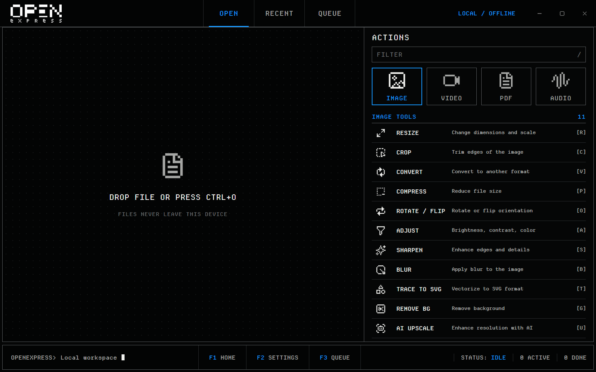

<p align="center">
  <picture>
    <source media="(prefers-color-scheme: dark)" srcset="public/openexpress-logo-pixel-white.svg" />
    
  </picture>
</p>

<p align="center">
  A local-first desktop workbench for fast image, video, PDF, and audio tasks.
</p>

<p align="center">
  <a href="https://github.com/oshtz/openexpress/actions/workflows/ci.yml"></a>
  <a href="https://github.com/oshtz/openexpress/releases/latest"></a>
  <a href="LICENSE"></a>
</p>



OpenExpress turns common media operations into focused desktop tools. Drop a file, choose a compatible action, configure the result, and process it without uploading the source file.

## Download

Download the current build from [GitHub Releases](https://github.com/oshtz/openexpress/releases/latest):

- **Windows:** portable `OpenExpress-Portable.exe`. The release notes state whether it is Authenticode signed.
- **macOS:** signed and notarized app, distributed as `OpenExpress.dmg` and `OpenExpress.app.zip` for self-update.
- **Integrity:** verify downloads with the release's `SHA256SUMS.txt`.

Windows and macOS are the release targets. Linux remains available as a development build target.

## Workbench

- Drag and drop files, use the compatible file picker, or paste an image from the clipboard.
- Search all 31 tools from one command surface and filter by media category.
- Track active and completed work in the queue and job tray.
- Reopen outputs, reveal their folders, or run the same tool again from recent history.
- Choose a default output folder or keep collision-safe results beside each source file.
- Launch compatible actions from Windows Explorer and macOS Finder.
- Check, download, and install verified updates from Settings.

## Tools

- **Image:** Resize, Crop, Convert, Adjust, Compress, Rotate / Flip, Sharpen, Blur, Trace to SVG, Remove BG, AI Upscale
- **Video:** Trim, Convert, Resize, To GIF, Speed, Extract Audio, Crop, Reverse, Mute, Merge
- **PDF:** Merge, Image to PDF, Compress, Split, Organize
- **Audio:** Trim, Convert, Fade In, Fade Out, Volume

AI model files are not bundled. The app downloads them only after explicit user action, verifies their checksums, and runs inference locally.

## Local-First Boundary

Media processing runs on the device through Rust, FFmpeg, and local ONNX inference. OpenExpress has no account requirement, file-upload path, or telemetry service.

Network access is limited to:

- user-initiated update checks and downloads from GitHub Releases;
- user-initiated AI model downloads;
- a first-use FFmpeg download when no compatible local binary is available.

## Usage

1. Open OpenExpress and drop a file, or press `Ctrl/Cmd+O`.
2. Pick one of the compatible tools.
3. Adjust the options and run the task.
4. Open the result from the job tray or Recent view.

Useful shortcuts:

- `F1`: Home
- `F2`: Settings
- `F3`: Queue
- `/`: Focus tool search
- `Ctrl/Cmd+,`: Settings
- `Ctrl/Cmd+V`: Paste an image where image input is supported

## Native File Menus

**Windows:** Settings can install, repair, or remove a per-user `Open with OpenExpress` submenu. Right-click one or more supported files to launch a specific compatible tool or the generic picker. Windows 11 places this integration under **Show more options**.

**macOS:** The signed app bundle declares an `Open with OpenExpress` Finder Service for supported images, videos, audio files, and PDFs. Find it in Finder's **Services** submenu.

## Requirements

- Node.js >= 20.19.0 or >= 22.13.0
- Rust >= 1.88
- [Tauri prerequisites](https://tauri.app/start/prerequisites/) for the host platform

## Develop

```sh
npm ci
npm run tauri dev
```

Vite runs at `http://localhost:5173` and the Tauri shell reloads as the frontend and Rust backend change.

## Build And Release

```sh
npm run tauri build
```

Local bundles are written under `src-tauri/target/release/bundle/`. Tagged releases create a draft containing the Windows portable executable, macOS DMG, macOS updater archive, updater manifest, and checksums.

Windows signing is optional: when both signing credentials are configured, the workflow signs the executable. Signed and unsigned Windows builds are included in self-update metadata and verified with SHA-256 before replacement. Partial signing configuration fails the release. macOS signing and notarization remain required.

## Verification

```sh
# Frontend and release metadata
npm run check:version
npm run audit:prod
npx tsc --noEmit -p tsconfig.app.json
npm run lint
npm test
npm run build
npm run smoke:routes

# Rust backend
cd src-tauri
cargo fmt --all -- --check
cargo clippy --all-targets -- -D warnings
cargo test
cargo audit
cargo +1.88.0 check --locked
```

## Project Layout

```text
src/                         React and TypeScript frontend
  pages/                     Workbench and media tool routes
  components/                Shared controls and desktop shell UI
  hooks/                     Processing, launch, and keyboard workflows
  stores/                    Local application state
  lib/                       Tool catalog, output paths, and utilities

src-tauri/                   Tauri shell and Rust backend
  src/plugins/               Image, video, PDF, audio, model, and clipboard logic
  src/shell/                 Explorer and Finder integration
  src/updater.rs             Verified GitHub Releases updater
  capabilities/              Tauri permissions
  tauri.conf.json            Bundle and application configuration
```

## License

MIT. See [LICENSE](LICENSE).
